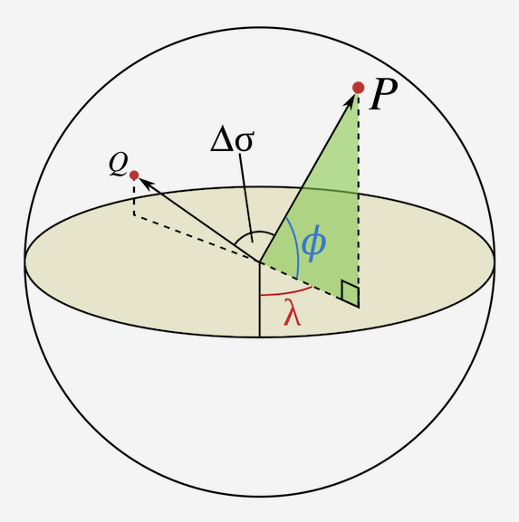

# State-Space Search Project

This is a project written in Java 11 that compares three common state-spaec search algorithms for Artificial Intelligence. The three algorithms in question are:
- A* ("AStar")
- Uniform Cost Search (UCS)
- Greedy Best First Search

The Problem is derived given a weighted, directed graph stored in `france.txt`
What the graph looks like:

The program is also given a list of French cities' lattitude and longitudes. This allows some search algorithms to estimate the chord distance between two coordinated using the Haversine Formula 

